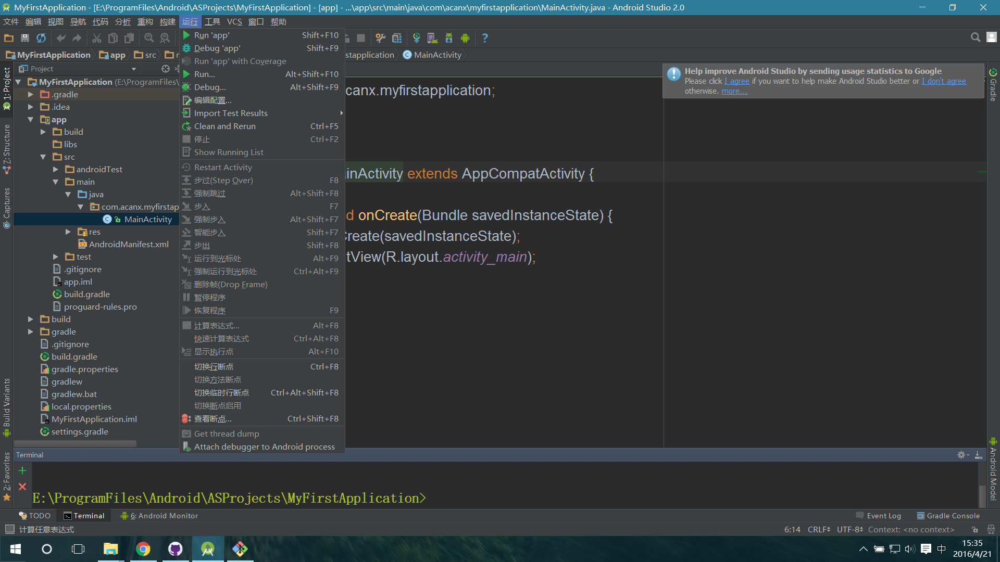

# AndroidStudio-ChineseLanguagePackage
# AndroidStudio 简体中文汉化包

---
## AndroidStudio简介：
- AndroidStudio是Google官方推出的基于 IntelliJ IDEA的Android开发IDE. 
- Android Studio 2.0是为Android平台打造高品质，高性能的应用程序的最快方式，包括手机、平板电脑，Android Auto，Android Wear和Android TV。作为谷歌官方的IDE，Android Studio包括你需要建立的任何应用程序，其中包括代码编辑器，代码分析工具，模拟器等等。这个新的、稳定的Android Studio版本具有快速构建速度和支持最新Android版的快速的仿真器以及谷歌播放服务。


---
## AndroidStudio v2.0.0.20汉化介绍
### v2.0 resource_en.jar------> resource_cn.jar

- 此汉化基于AndroidStudio V2.0（v2.0.0.20-20160408）最新V2.0稳定版本
- 使用前请下载并安装 AndroidStudio_2.0.0.20-bundle-143.2739321-windows.exe

---

## AndroidStudio v2.3/4 版汉化
### v2.3/4 resource_en.jar  ------> resource_cn.jar

- 基于AndroidStudio V2.3.1/v2.4（v2.3.1.0.20-20170404/v2.4）最新V2.3.1稳定版本
- 使用前请下载并安装 AndroidStudio-v2.3.1或更高版本

---


## 目录介绍
```
AndroidStudio-ChineseLanguagePackage/
├─AndroidStudio-Lang-Pkg-Translate/                                  //V2.0.0.20版语言包 基于谷歌翻译网页版的机器批量翻译程序源码 
│   ├─ .idea/
│   ├─ src/
│   └─ README.md
├─AndroidStudio_v2.0.0.20_zh-cn/                                     //V2.0.0.20版翻译项目目录
│   ├─resources_cn/
│   └─README.md
├─AndroidStudio_v2.0.0.20_en/                                        //V2.0.0.20版英语语言解压包
│   ├─resources_en
│   └─README.md
├─Release/ 
│	│─AndriodStudio-v2.0.0.20_resources_cn-v0.1-20160405/
│	│─AndroidStudio_v2.0.0.20_resources_cn-v0.2-20170414/
│	│─AndriodStudio-v2.0.0.20_resources_cn-v0.1-20160405.jar
│	│─AndroidStudio_v2.0.0.20_resources_cn-v0.2-20170414.jar
│	└─README.md 
├─Doc/
├─.gitignore     
├─LICENSE
└─README.md
```

## 汉化包下载
- [汉化资源下载链接汇总](./Doc/Download.md)
- [AndroidStudio中文社区汉化包下载](http://www.android-studio.org/index.php/chinese)


## 安装及使用方法
### 使用说明
- 此汉化包仅适用于AndroidStudiov2.0.0.20版本，其它版本未验证，请慎用，替换前请做好相关文件的备份。
- 英文语言包位于  安装目录/lib/resource_en.jar 

### 使用方法：
* [1] .下载本项目根目录/Release/ 下的对应的已发布的jar汉化包文件(其它下载源请查阅 [汉化资源下载链接汇总](./Doc/Download.md) );
* [2] .将[1]中下载的jar包重命名为“resource_en.jar”，并保存;
* [3] .备份 “AndroidStudio安装目录/lib/resource_en.jar” 文件(非常重要);
* [4] .将[2]中的resource_en.jar文件移动到  AndroidStudio安装目录/lib/目录  替换原版的英语语言包文件resource_en.jar
* [5] .执行[4]后会弹出对话框，选择同意替换；
* [6] .关闭窗口，正常打开AndroidStudio IDE，汉化完成，汉化后效果如上预览图所示。


## 参与汉化
- [如何汉化](./Doc/HowToTranslate.md)
- [AndroidStudio-ChineseLanguagePackage讨论交流](http://ask.android-studio.org/?/question/1494)
- [AndroidStudio2.0.x讨论交流](http://ask.android-studio.org/?/question/1009)
- [汉化交流](http://ask.android-studio.org/?/people/list/group_id-100)

---
### 更新
- [AndroidStudio汉化更新日志](./Doc/AndroidStudio-ChineseLanguagePackageUpdateLog.md)
- [AndroidStudio更新日志](./Doc/AndroidStudioUpdateLog.md)


### 致谢
   汉化翻译中，有参考和使用第三方作者的提供的资源和工具，在此一并致谢：
- [Android Studio 中文组](http://www.android-studio.org/index.php/team)  
    - [wellchang](http://ask.android-studio.org/?/people/wellchang)       |     [vichild](http://blog.csdn.net/vichild/)  |    [zhangwei](#)
- [smzy](http://www.smzy.com/smzy/down161822.html)


### 友情链接
- [Android Studio 中文社区](http://www.android-studio.org/)
- [AndroidStudioTranslate/Android-Studio-Translate](https://github.com/AndroidStudioTranslate/Android-Studio-Translate)
- [Android-Studio-Translate-Tool](https://github.com/AndroidStudioTranslate/Android-Studio-Translate-Tool)


